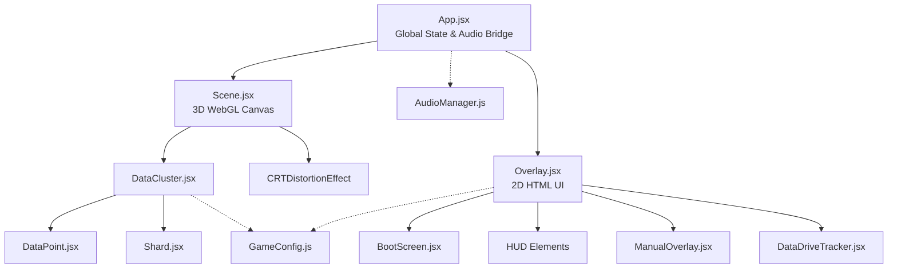

# Radial Stream (Noderunner) Architecture

## Overview
Radial Stream is a hybrid layered application that distinctly separates a high-performance 3D WebGL context from a traditional 2D HTML/CSS interface. These two layers are bridged together using React state and refs, ensuring high framerates without triggering unnecessary UI re-renders.

## Component Graph

## Layer Breakdown

### 1. The Root Layer (`App.jsx`)
Acts as the bridge between the 3D world and the 2D UI. 
- Holds the global state (`bootComplete`, `gameMode`, `score`, `diagnosticsActive`).
- Manages the singleton `AudioManager` instance so audio persists across re-renders.
- Layers the two main components directly on top of each other: `<Scene />` (the 3D canvas at Z-index 0) and `<Overlay />` (the 2D HTML at Z-index 10).

### 2. The 3D Engine Layer (`Scene.jsx` & React Three Fiber)
Entirely dedicated to the WebGL canvas. It does not use standard HTML; everything here is rendered by the GPU using Three.js.
- **`Scene.jsx`**: Sets up the camera, lighting, and the `CRTDistortionEffect` post-processing pipeline.
- **`DataCluster.jsx`**: The procedural generator. Mathematically calculates the 3D positions of all nodes and wires them together.
- **`DataPoint.jsx` & `Shard.jsx`**: Individual interactive 3D nodes. Uses `useFrame` for animations and handles 3D raycast click events.

### 3. The 2D User Interface Layer (`Overlay.jsx` & Sub-components)
The traditional HTML/CSS layer that sits invisibly on top of the 3D canvas, intercepting clicks only where there are visible UI elements.
- **`BootScreen.jsx`**: Handles the initial CRT boot sequence and terminal text.
- **`Overlay.jsx`**: The master HUD. Draws the target reticles, mission text, and wireframe terminal boxes.
- **`ManualOverlay.jsx`**: The draggable, framer-motion powered instructional window.
- **`DataDriveTracker.jsx`**: UI component tracking combo/score progress.

### 4. The Core Managers (Pure JavaScript)
Utility classes that run outside of the React lifecycle to ensure high performance.
- **`AudioManager.js`**: Controls the browser's native `AudioContext`. Synthesizes ambient drones and click sounds using pure math (oscillators).
- **`GameConfig.js` & `StoryData.js`**: Configuration dictionaries that hold constants (colors, distances, speeds) and randomized text fragments.
